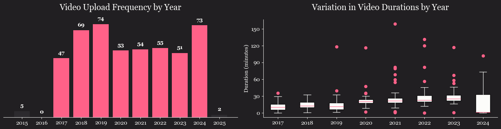
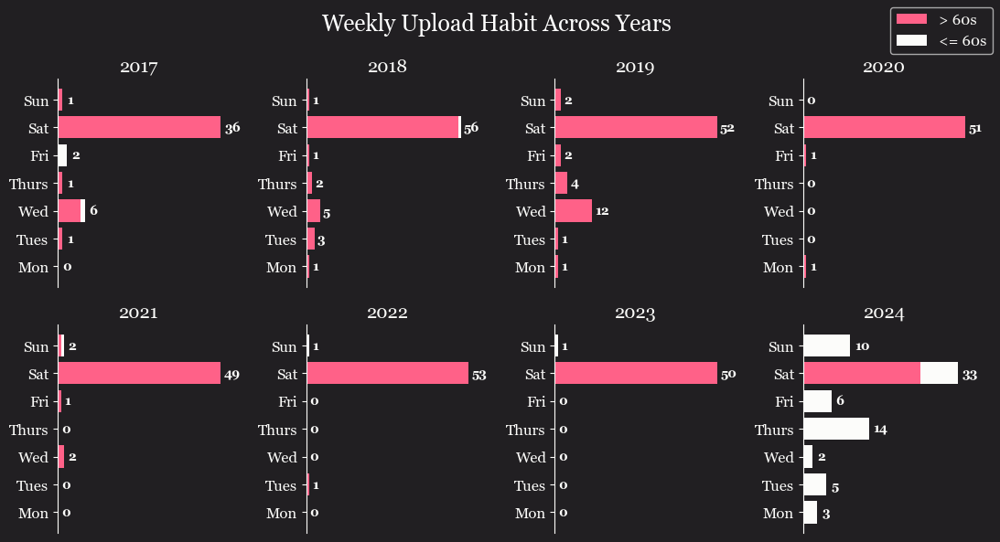
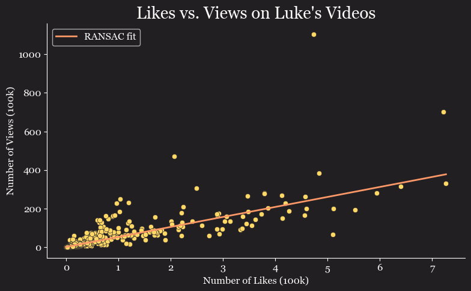
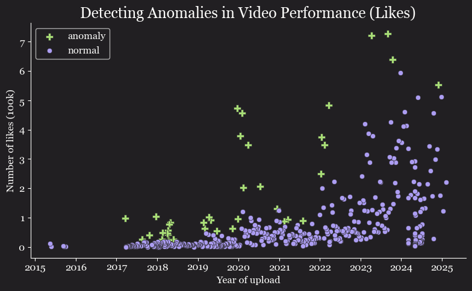

# **YouTube Channel Analysis: Outdoor Boys**  

## **📌 Project Overview**  
This project analyzes the **Outdoor Boys YouTube channel (Luke Nichols)** to uncover trends in upload frequency, video duration, and engagement metrics. Data was collected and processed using the **YouTube API** to explore patterns in video performance and audience interaction.  

## **Key Findings**
- Luke's upload frequency peaked in 2019, with a subsequent rise in 2024.
- Video durations have gradually increased throughout the years.
- Each year, almost all of his videos were uploaded on Saturdays.
- In 2024
    - There was a notable drop in average video duration.
    - Furthermore, Luke started to have a significantly wider variation in the duration of his uploads.
    - Content strategy changed with "Youtube Shorts" (videos 60 seconds or below) being uploaded throughout the week, also explaining the notable drop in average duration + wider variation of duration that year.
- About one in every 52 viewers who clicked on his videos hit the like button.
- Each year contains high-performing videos (outliers based on likes each year), likely driving his regular performing video to grow exponentially in likes over time.

## **Tools & Libraries**  
- **Python**  
- `pandas`, `numpy` for data handling  
- `matplotlib` for visualizations  
- `googleapiclient.discovery` to access YouTube API

## **Data Collection & Processing**  
- **Source:** YouTube API  
- **Attributes Collected:** [video]  id, title, published_date, year, month, day, num_views,
       num_likes, length, quality, tags, num_tags  
- **Processing Steps:**
  - Dropped unnecessary attributes
  - Extracted new columns  
  - Corrected column data types 
  - Reordered columns

## **Visualizations**  
Here are some key visual insights from the dataset:  

### **Upload Frequency Over Time & Video Duration Trends**  
  
  

### **Relationship Between Likes and Views**  
  

### **Year Outliers in Video Likes**  
  

## **Future Steps**  
- **Apply Hypothesis Tests**
    1. The introduction of YouTube Shorts in 2020 significantly increased the average engagement. (two-sample t-test)
    2. Videos uploaded on weekends receive significantly more engagement than weekday uploads. (ANOVA) 
- **More Time-Based Trends** - Analyzing engagement patterns across months/seasons  
- **Predictive Modeling** - Forecasting video performance (probably with more videos across a variety of different channels)